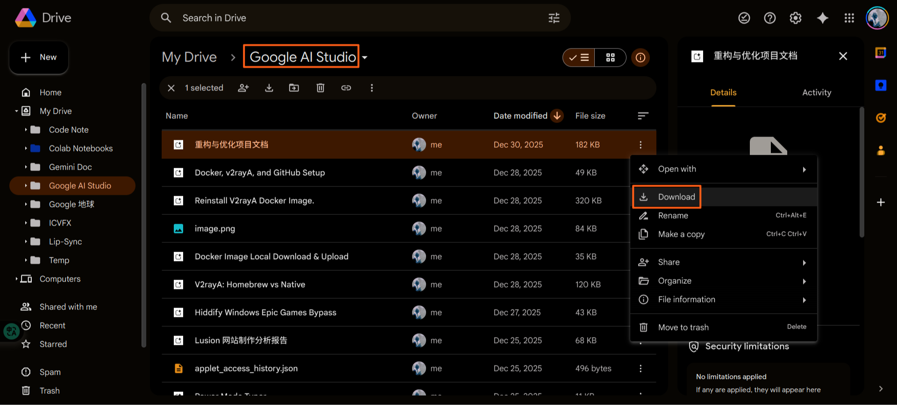

# AI Studio Chat to Markdown Converter

**[Live Demo](https://aistudio2md.streamlit.app/)**

A Streamlit-based Python application that converts AI Studio chat records downloaded from drive.google.com into clean, structured Markdown files.

## Features

- Batch processing: Upload multiple chat record files for conversion
- Smart conversion: Automatically extracts user queries and AI responses
- Intelligent header downgrading: Detects and adjusts header levels to avoid conflicts
- Download options: Individual file downloads or ZIP package
- Real-time preview: Preview converted Markdown content
- Format preservation: Maintains code blocks, links, lists, and tables
- Smart fixes: Automatically repairs unmatched backticks

## Installation

### Prerequisites

- Python 3.8 or higher
- pip

### Steps

1. Clone or download the project
2. Create virtual environment (recommended)
3. Install dependencies: `pip install -r requirements.txt`
4. Run the app: `streamlit run app.py`
5. Open browser at http://localhost:8501

## Getting AI Studio Chat Records

Chat records are downloaded from the Google AI Studio folder in drive.google.com:

1. Go to drive.google.com
2. Navigate to the "Google AI Studio" folder
3. Download the chat record files you need



## Usage

Upload AI Studio chat record files and convert them to Markdown format.

## Output Format

Converted Markdown files contain:

```markdown
# Chat Title

**Source File:** original_filename.json
**Created:** 20240101_143022

---

# User
User's question or query...

# AI Studio
AI Studio's response including:
- Text responses
- Code blocks (preserved format)
- Links and references
- Lists and tables

# User
Follow-up user questions...

# AI Studio
Corresponding responses...
```

## Technical Features

### JSON Structure Support

Supports two JSON formats:

**Format 1: chunkedPrompt structure**
```json
{
  "chunkedPrompt": {
    "chunks": [
      {
        "role": "user",
        "text": "User's question",
        "isThought": false
      },
      {
        "role": "model",
        "text": "AI's response",
        "isThought": false
      }
    ]
  }
}
```

**Format 2: Direct array structure**
```json
[
  {
    "role": "user",
    "text": "User's question",
    "isThought": false
  },
  {
    "role": "model",
    "text": "AI's response",
    "isThought": false
  }
]
```

### Content Processing

- Skips thought processes (`isThought: true`)
- Fixes unmatched backticks
- Cleans up extra empty lines
- Preserves original formatting

## Project Structure

```
aistudioMD/
├── app.py                # Main Streamlit application
├── requirements.txt      # Python dependencies
├── README.md            # Project documentation
└── code/                # Chrome extension code (reference)
    └── v1/
        ├── manifest.json
        ├── popup.html
        ├── popup.js
        ├── content.js
        └── ...
```

## License

This project is open source under the MIT License.

## Acknowledgments

Inspired by the [AistudioChat2Markdown](https://github.com/LarryGuan/AistudioChat2Markdown) Chrome extension project.